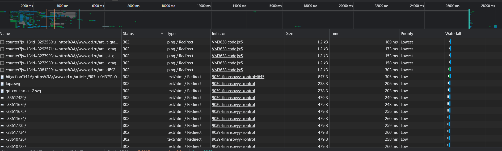

# Crome-Dev

### 1. На вкладке Network

#### 1.1. Профиль загрузки ресурсов [HAR](./www.gd.ru.har)

#### 1.2. Неоптимальные места:

##### 1.2.1. Дублирование ресурсов

- code.js повторился 2 раза
  

- www.1cont.ru повторился 2 раза
  

- fontawesome-webfont.woff2?v=4.7.0 повторился 2 раза
  

- https://mp-events.mi.action-media.ru/user-recognition повторился 4 раза ( 2 раза с кодом 204 и 2 раза с 200)
  

- cast_sender.js повторился 2 раза
  

##### 1.2.2. Лишний размер ресурса

- На данной фотографии можно заметить, что присутсвуют js и css файлы, которые весят больше 100 kB. А также файл png, который весит много для картинки
  

##### 1.2.3. Медленно загружающиеся ресурсы

- Можно заметить, что есть 3 запроса, которые завершили свою работу с ошибкой. Из них 2 были больше 2 секунд. Самое оптимальное время это примерно 1 секунда или меньше.
  

##### 1.2.4. Ресурсы, блокирующие загрузку

- Ресурсы, которые запустились до загрузки страницы.
  

##### 1.2.5. Дополнительно

- Запросы, которые закончились с ошибкой или были отменены.
  

- Запросы со статусом 302 из-за которых происходят лишние запросы и нагружают загрузку сайта.
  

- Заблокированные запросы
  

---

### 2.

#### 2.1.

#### 2.2.

#### 2.3.

#### 2.4.

---

### 3.

#### 3.1.

#### 3.2.

#### 3.3.
